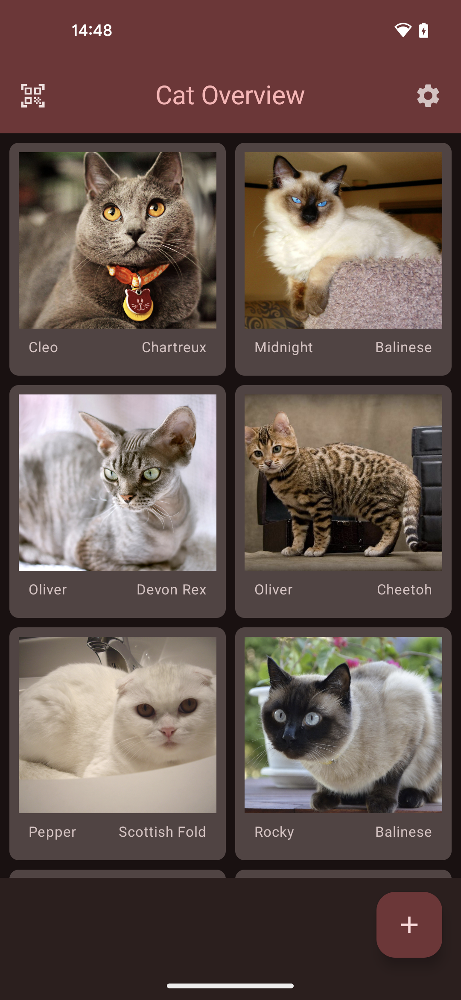
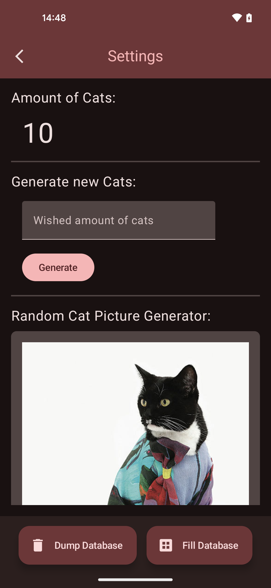
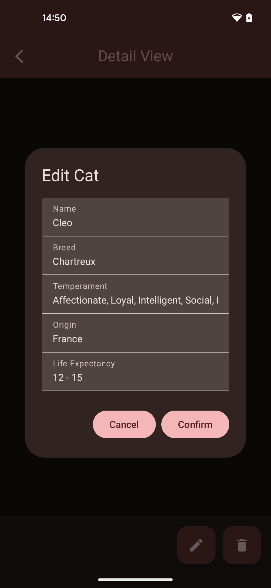
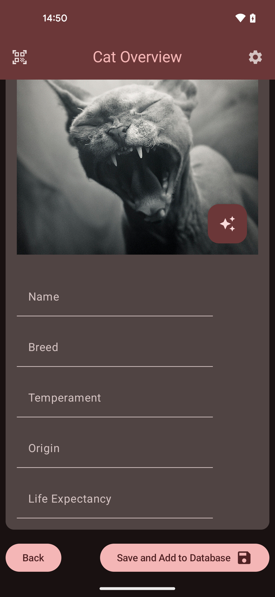

# [Random] Cat App README

This native Android app was created as a practical assignment for the course "Development of Mobile Applications." It allows users to retrieve, display, and store random cat information.

## Technical Details

*   **Programming Languages:** Primarily Kotlin, with some unused Java components.
*   **Build System:** Gradle
*   **Development Environment:** Android Studio Jellyfish | 2023.3.31 Patch 2
*   **Tested Devices:**
    *   Google Pixel 5 (Android 14.0, API 34-ext12)
    *   Virtual Pixel 7 Pro (Android 14.0, API 34)

## Installation and Execution

1.  **Dependencies:** Ensure all necessary dependencies are installed and synced to the specified versions.
2.  **API Key:**
    *   Obtain an API key from The Cat API website: https://thecatapi.com/
    *   Alternatively, use the provided API keys.
3.  **Start:** Run the app on a physical Android device or an Android/iOS simulator.

## Screenshots

<table> <tr> <td></td> <td></td> </tr> <tr> <td></td> <td></td> </tr> </table>
